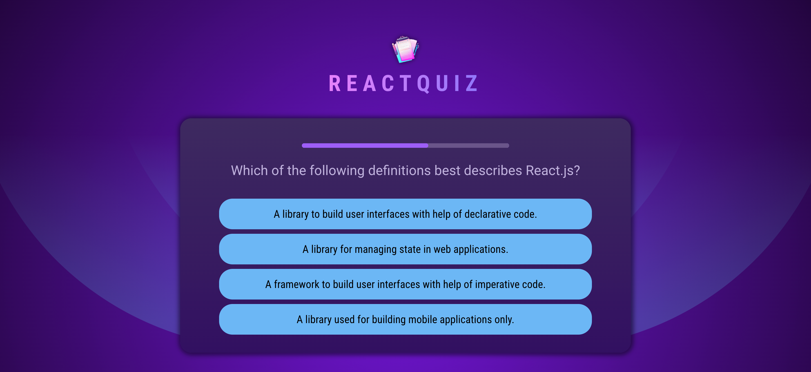

# Quiz-app

A simple project built as part of a Udemy course to practice React.

## Features

## Tech Stack

## Usage

## Installation

1. Clone the repository:
   ```bash
   git clone https://github.com/halynabondar/ReactQuiz.git
   ```

2. Install dependencies:
   ```bash
   npm install
   ```

3.	Start the project:
   ```bash
   npm run dev
   ```

## Screenshot

